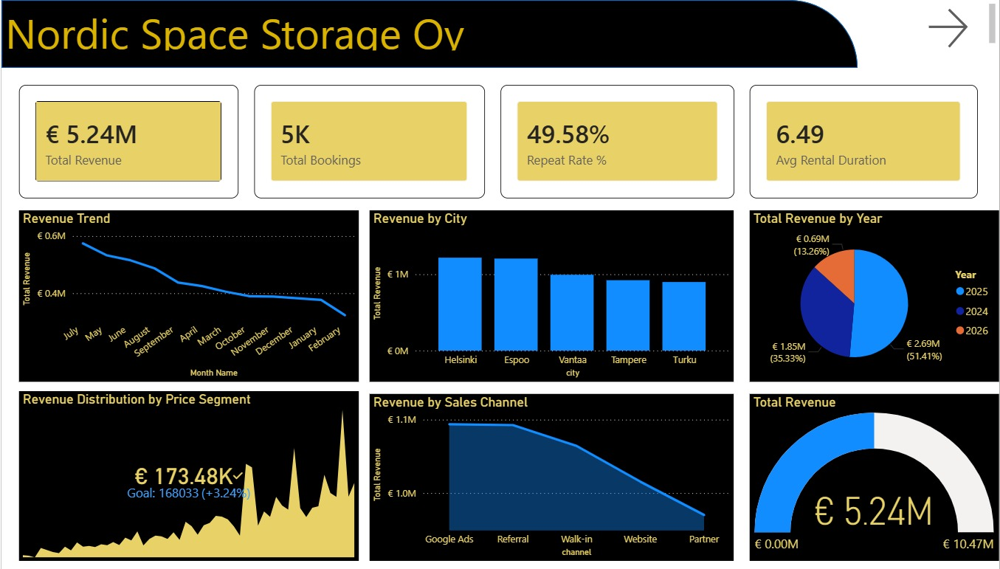
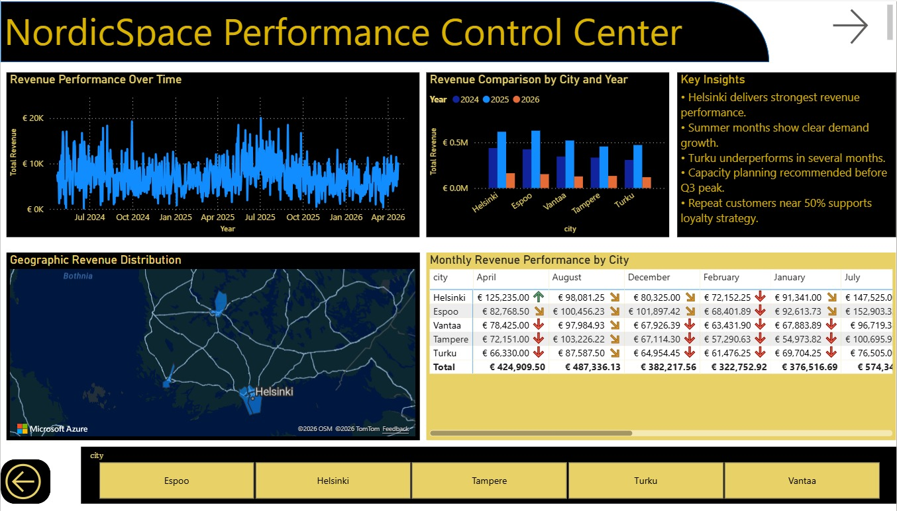
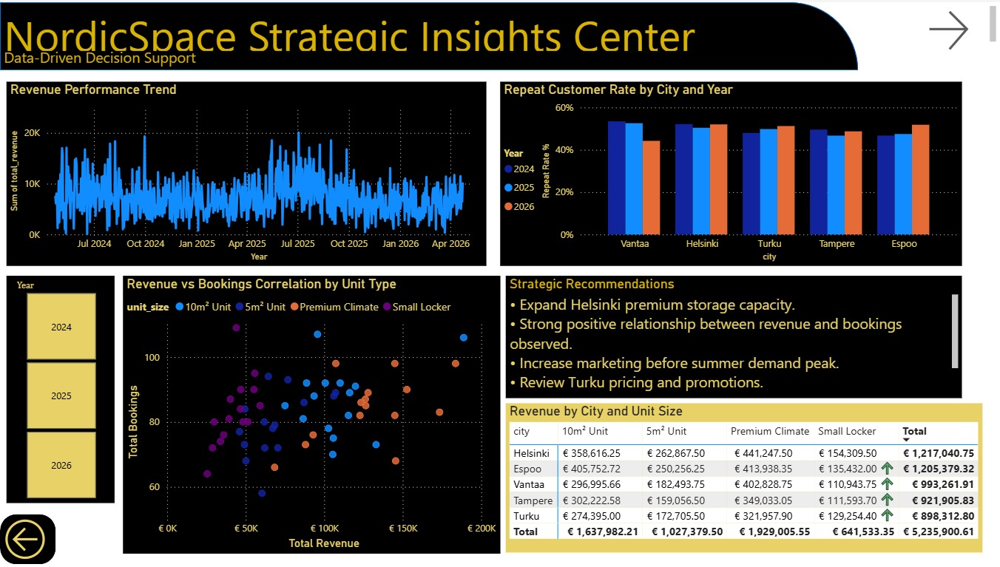

# NordicSpace Business Analytics Project
## Dashboard Preview

### Executive Dashboard

### Performance Control Center

### Strategic Insights

## Overview
This project demonstrates an end-to-end business analytics workflow using Python and Power BI.  
It simulates a storage company environment to analyze business performance and support data-driven decision-making.

## Objectives
- Collect and integrate data from multiple sources
- Perform data cleaning and transformation
- Conduct descriptive, predictive, and prescriptive analytics
- Build KPI dashboards for performance monitoring
- Generate actionable business insights

## Data Sources
- CSV data (bookings)
- API data (external factors)
- Unstructured data (customer feedback)

## Tools & Technologies
- Python (Pandas, Matplotlib)
- Power BI
- Excel
- SQLite

## Key Features
- KPI Dashboard (Revenue, Bookings, Customer Metrics)
- Performance Control Dashboard
- Strategic Insights Dashboard
- Trend Analysis & Forecasting
- Correlation & Benchmarking Analysis

## Key Insights
- Helsinki shows highest revenue performance
- Seasonal demand increases during summer months
- Positive correlation between bookings and revenue
- Opportunity to improve retention strategies

## Business Recommendations
- Expand capacity in high-performing regions
- Optimize pricing strategies for low-performing areas
- Increase marketing before peak seasons
- Improve customer retention programs

## Note
This project is based on a simulated business scenario for educational purposes.